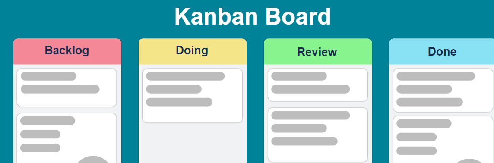

# Kanban Board API

Esta é uma _API RESTful_ que gerencia um quadro de kanban, permitindo a criação, leitura, atualização e exclusão de cartões (cards) em listas.

### Para executar a aplicação:

- Clonar o projeto
- Definir um appsettings.Development.json para BACK/src/Kambam.API ([exemplo aqui](BACK/src/Kambam.API/appsettings.example.json))
- [Instalar a engine docker](https://docs.docker.com/engine/install/)
- Dentro da pasta do projeto, rodar o comando `docker compose up`

Isso iniciará o serviço da API e do frontend, o serviço do banco de dados _PostgreSQL_ e aplicará as migrações para criar a estrutura do banco de dados.

- o endereço da frontend da aplicação estará disponível em http://localhost:5001
- endereço do backend da aplicação estará disponível em http://localhost:5000
- [coleção do postamn para as apis de listagem, cadastro, atualização e remoção de cards bem como do login](BACK/postman_collection.json)
- o endereço para o gerenciador de banco de dados (PgAdmin) web estará disponível em http://localhost:5050

### Para executar os testes unitários:

- [Instalar o SDK .Net 7](https://docs.docker.com/engine/install/)
- No projeto clonado, acessar a pasta BACK/src/Kambam.Tests
- Rodar o comando `dotnet test`

### Estrutura do Projeto

A estrutura do projeto segue os princípios:

- Clean Architecture
- Clean Clode
- TDD
- DDD
- Design Patterns

**Diferenciais**

- Usa PostgreSQL com Entity Framework para persistência de dados.
- Utiliza AutoMapper para mapeamento de objetos entre DTOs e entidades de domínio.
- Uso do Fluent Assert para escrita de testes mais semânticos e fáceis de ler.
- Docker Compose configurado para executar todo o ambiente
