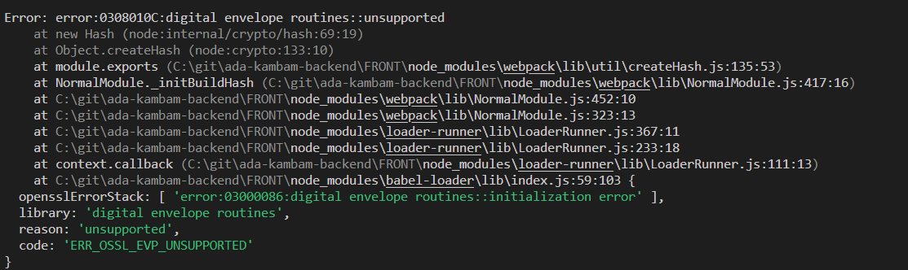

# Kanban Board API

Esta é uma _API RESTful_ que gerencia um quadro de kanban, permitindo a criação, leitura, atualização e exclusão de cartões (cards) em listas.

**Para executar a aplicação:**

- Clonar o projeto
- Dentro da pasta do projeto, rodar o comando `docker compose up`

Isso iniciará o serviço da API, o serviço do banco de dados _PostgreSQL_ e aplicará as migrações para criar a estrutura do banco de dados.

- o endereço da frontend da aplicação estará disponível em http://localhost:5000 (não funciona, explicação mais abaixo).
- endereço do backend da aplicação estará disponível em http://localhost:5000 (coleção do postamn para as apis de listagem, cadastro, atualização e remoção de cards bem como do login).
- o endereço para o gerenciador de banco de dados web estará disponível em http://localhost:5050

###Estrutura do Projeto
A estrutura do projeto segue os princípios:

- Clean Architecture
- Clean Clode
- TDD
- DDD
- Design Patterns

**Diferenciais**

- Usa PostgreSQL com Entity Framework para persistência de dados.
- Utiliza AutoMapper para mapeamento de objetos.
- Uso do Fluent Assert para escrita de testes mais semânticos.
- Docker Compose configurado para executar todo o ambiente

**Observação**

O frontend apresenta problemas em função de algo faltando no processo de compilação ao rodar _yarn start_, como orienta a documentação. Após várias tentativas entre desinstalção e instalação do node, yarn, remoção de node_modules e reistalação de todos os pactoes, o erro persistiu. Por favor, se souber qual o problema me avise que faço a correção imediata. O erro:

Apesar disso, o front foi parametrizado com variáveis de ambientes em suas urls que são chamadas no cardService.js (para tornar dinamico esse endereço dentro da rede do docker compose), criado seu Dockerfile e adicionado aos serviços do docker compose.
